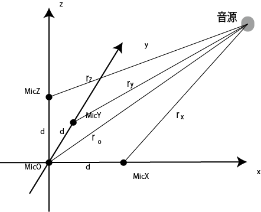
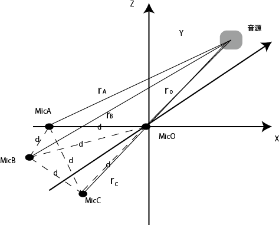
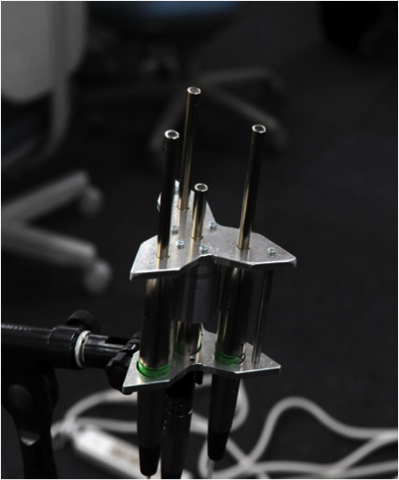
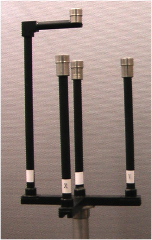
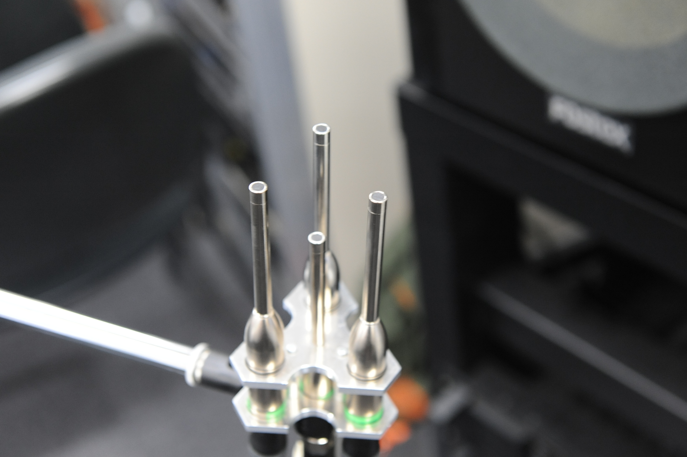
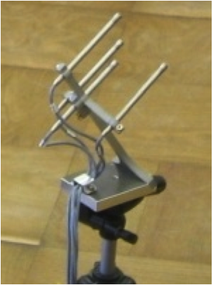

#近接4点法について

####About Closely Located Four Point Microphone Method

- 早稲田大学 及川研 M2 中村康祐


##構成

- 近接4点法とは

- これまでの近接4点法

- 私の研究した近接4点法

- 今後


##近接4点法とは

- 同一平面上に無い4つのマイクロホンに収録された信号のわずかな時間情報の相違に着目

- 短時間相関などから音の位置や大きさなどの空間情報を算出


###簡単に言うと

- 4つのマイクロホンへの音の到達時間の差から音源位置を推定

- 具体的には

  - 相互相関 or インテンシティを用いて音の到達時間差を算出

  - その後に、三角測量的計算手順で音源位置を算出

####その一連の流れを近接4点法と呼称


##近接4点法原理図

- 直交座標型近接4点法マイクロホン



- 直交座標型近接4点法マイクロホン




##近接4点法マイクロホン










##これまでの近接4点法

- これまで、数多くの研究者が近接4点法に関して研究

  - 近接4点法自体

  - 近接4点法の応用・活用

  - 他の手法との組み合わせ


##学会発表など

```
1976, ディジタル技術を用いた室内音響特性の測定, 山須田繁・村田敏健・山崎芳男・伊藤毅
1978, 室内音場へのディジタル処理技術の適用, 山須田繁・小暮啓史・山崎芳男・伊藤毅
1978, ディジタル技術を用いた室内の空間情報の一測定法, 斎藤博之・小路法男・安川謙一郎・山須田繁・山崎芳男・伊藤毅
1981, 近接する4点のインパルス応答により求めたホールの空間情報, 山崎芳男・石原肇・桜井幸光・海老名修・伊藤毅
1982, 建築音響測定へのディジタル技術の応用, 山崎芳男
1984, 近接4点受音による室内空間情報の把握とその展開, 遠藤健二・渡辺理一郎・佐藤秀明・田中士郎・山口晃久・山崎芳男・伊藤毅
1985, ディジタル信号処理を用いた音場の空間情報の把握と評価, 遠藤健二・堀越孝之・山崎芳男・伊藤毅
1986, 近接4点法による音場の相関関数の計測, 山崎芳男・伊勢史郎・清山信正・伊藤毅
1986, パーソナルコンピュータを用いた近接4点法による室内空間情報の把握, 佐藤達司・遠藤健二・堀越孝之・山崎芳男・伊藤毅
1986, 近接4点法を用いた室の拡散性の評価, 遠藤健二・山崎芳男・伊藤毅
1987, 近接4点法によるコンサートホールの音響測定, 山崎芳男・伊藤毅
1987, 近接4点法ウィグナー分布によるコンサートホールの解析, 山崎芳男・金允起・吉川浩史・新解雅也・清山信正・伊勢史郎・榎田葉子・伊藤毅
1987, 近接4点法により得られた仮想音源の展開 -音場の過度状態の把握-, 伊勢史郎・清山信正・岡田利一・山崎芳男・伊藤毅
1987, 近接4点法によるコンサートホールの音響測定, 山崎芳男・伊藤毅
1987, 近接4点法における適応型処理による反射音抽出, 伊勢史郎・高林和彦・中村聡延・清山信正・山崎芳男・伊藤毅
1987, 近接4点法へのインテンシティの適用, 清山信正・鈴木大介・村田清孝・伊勢史郎・山崎芳男・伊藤毅
1988, 近接4点法を用いた短時間インテンシティによる音場の評価, 清山信正・金允起・中村聡延・山崎芳男・伊藤毅
1989, 近接4点法を利用した満席時の伝送特性の推定, 山崎芳男・岡田俊哉・高林和彦・伊藤毅
1990, 近接4点法による音場分析の空間情報の可視化, 山崎芳男
1992, MEASUREMENT OF SPATIAL INFORMATIONIN SOUND FIELDS BY CLOSELY LOCATED FOUR MICROPHONES, Yoshio YAMASAKI
1995, 近接4点法による音響測定への高速1bit処理の導入, 工藤修二・唐川周三・遠藤一夫・山崎芳男・太田弘毅
1996, 一般調和解析による適応型近接4点法音場分析, 吉田訓康・林雅尚・大内康裕・工藤修二・山崎芳男
1997, 周波数変動を考慮した近接4点法による音源位置推定, 吉田訓康・山崎芳男
2000, 近接4点法を用いた屋外の移動音源の計測, 小野政一郎・田中巧・及川靖弘・山崎芳男
2000, 近接4点法を用いた屋外の移動音源の計測, 小野政一郎・田中巧・及川靖広・山崎芳男
2003, 近接4点法を用いた空間の把握 -音による空間形状および表面材質の把握と可視化-, 荻野粛・山崎芳男
2003, 近接4点法とドップラー効果による移動音源の位置推定, 金子穂積・武岡成人・山崎芳男
2004, 近接4点法を利用した球による音場の3次元表示, 横田林三・沖幸太郎・山崎芳男
2006, 一般化調和解析を用いた近接4点法による音場分析, 大内康裕・中沢誠・山崎芳男
2006, 4点法を利用した個体内部構造の把握, 真壁亮・及川靖広・山崎芳男
2011, 近接4点法による音場計測, 山崎芳男・小西雅
2012, 分散配置した近接4点法マイクロホンによる音源位置推定と音源分離, 小林万理恵・及川靖広・山崎芳男
2013, 分散配置した4つのマイクロホンによる音源位置推定, 中村康祐・及川靖広・山崎芳男
```
